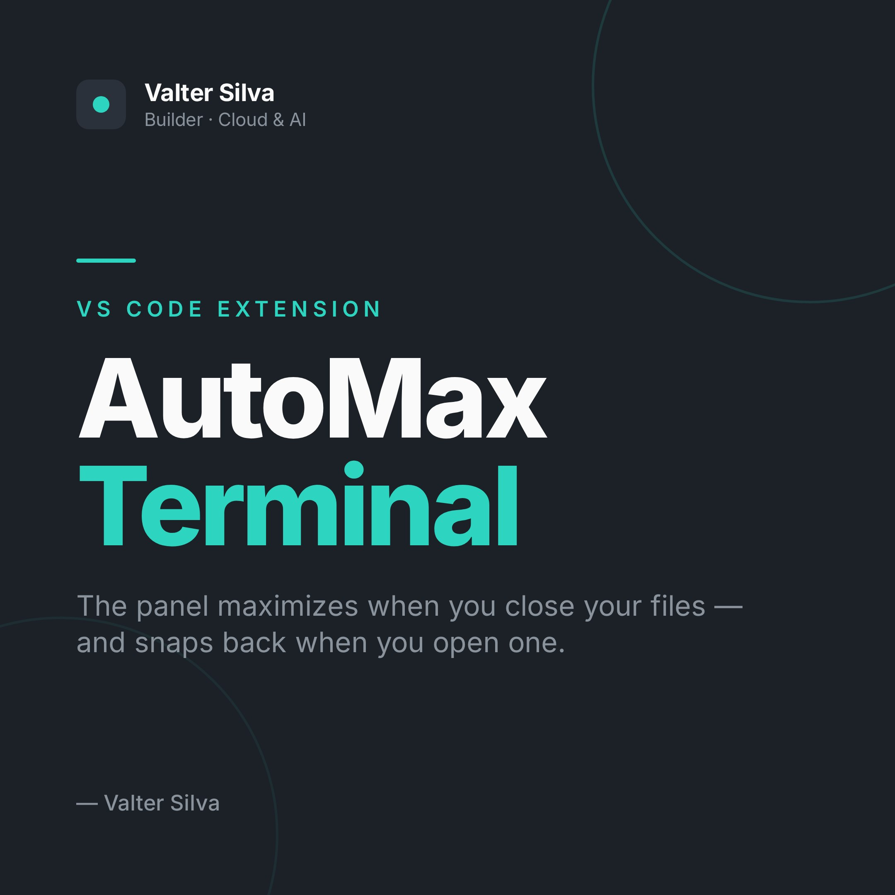
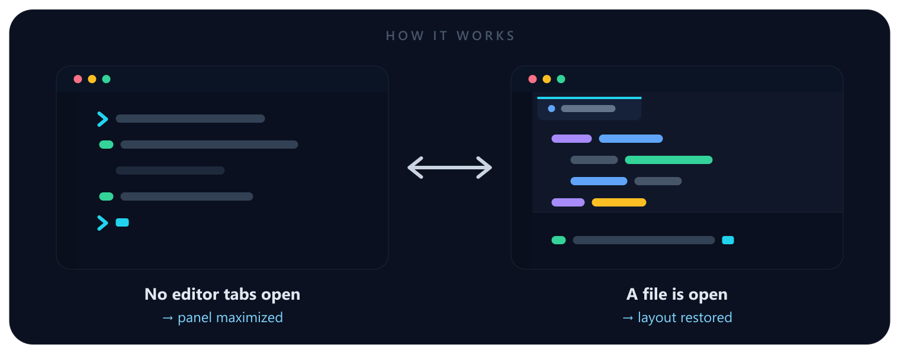

<div align="center">



<p></p>

[](https://github.com/valter-silva-au/vscode-automax-terminal/releases)
[](https://code.visualstudio.com/)
[](./extension.js)
[](./LICENSE)

</div>

<br/>

Work in a big terminal, but let the editor take over the moment you open a file — no keyboard shortcut, no manual toggling.

## ✨ Features

| | |
| --- | --- |
| 🖥️ **Auto-maximize** | Panel fills the window whenever there are zero editor tabs. |
| 🔁 **Auto-restore** | Opening any file brings your normal editor layout right back. |
| ⚙️ **One setting** | Flip it off anytime with `automaxTerminal.enabled`. |
| 🩹 **Self-heal** | A `resync` command recovers if you toggle the panel by hand. |
| 🪶 **Featherweight** | ~60 lines of plain JS, zero runtime dependencies. |

## 🎬 How it works

<div align="center">
  
</div>

The extension counts open editor tabs across all tab groups and reacts on every tab change, active-editor change, and at startup:

- **0 tabs open** → maximize the panel (`workbench.action.toggleMaximizedPanel`)
- **≥1 tab open** → restore the panel

## 📦 Requirements

- VS Code `1.67.0` or newer (uses the stable `window.tabGroups` API).

## 🚀 Install

Not on the Marketplace — install from a packaged `.vsix`:

```bash
# from the extension folder
npm install                       # pulls in @vscode/vsce (packaging only)
npx @vscode/vsce package          # produces automax-terminal-<version>.vsix
code --install-extension automax-terminal-0.2.0.vsix --force
```

Then **reload VS Code** (Command Palette → **Developer: Reload Window**) — the extension activates on startup.

Verify it landed:

```bash
code --list-extensions --show-versions | grep automax
# valter-silva-au.automax-terminal@0.2.0
```

> 💡 A local `.vsix` **won't auto-update** — see [Updating](#-updating).

## 🎬 Usage

Once installed and reloaded, it just works:

- **Close all editor tabs** → the panel maximizes.
- **Open any file** → the panel restores.

Toggle the behavior via the `automaxTerminal.enabled` setting (Settings → search *"AutoMax"*).

## ⚙️ Settings

| Setting | Default | Description |
| --- | --- | --- |
| `automaxTerminal.enabled` | `true` | Automatically maximize the panel when no editors are open, and restore it when a file is opened. |

## 🎛️ Commands

| Command | ID | What it does |
| --- | --- | --- |
| **AutoMax Terminal: Re-sync panel state** | `automaxTerminal.resync` | Reconciles tracking if the panel state has drifted — see below. |

## ⚠️ Known limitation

VS Code exposes the maximized panel only as a **toggle** (`workbench.action.toggleMaximizedPanel`) and gives extensions **no way to read** whether the panel is currently maximized. So the extension tracks that state internally.

If you maximize or restore the panel **by hand** (native shortcut or the panel's `···` menu), the internal tracking can drift and the extension may do the opposite of what you expect on the next tab change. To fix it:

1. Put the panel back in its **normal (non-maximized)** state.
2. Run **AutoMax Terminal: Re-sync panel state** from the Command Palette.

It resets tracking and re-applies the correct layout for your current editor count.

## 🛠️ Development

Plain JavaScript, no build step. Open the folder in VS Code and press <kbd>F5</kbd> to launch an Extension Development Host with the extension loaded.

## 🔄 Updating

Because it's installed from a local `.vsix`, there's no auto-update. After changing the code:

1. Bump `version` in `package.json` and add a `CHANGELOG.md` entry.
2. Repackage and reinstall:

   ```bash
   npx @vscode/vsce package && code --install-extension automax-terminal-*.vsix --force
   ```

3. Reload the window.

## 📄 License

[MIT](./LICENSE) © Valter Silva
